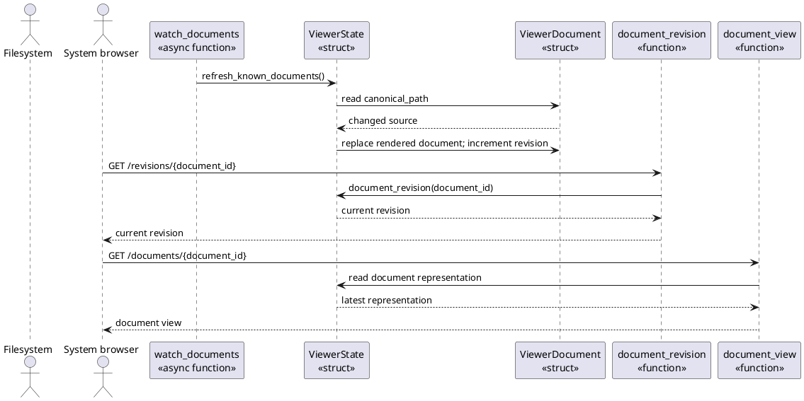
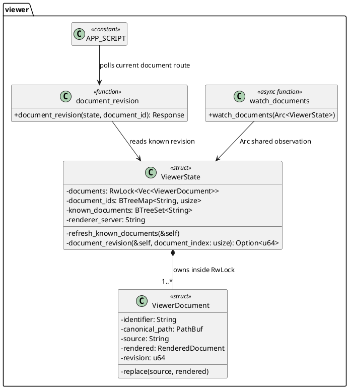

# FEAT-03 Automatic Refresh Design

Status: implemented in C4

This design realizes `UC-09` while preserving the fixed authorization boundary
of `FEAT-01`. A document revision is a monotonically increasing, session-local
number: it changes only after Lens has successfully read and rendered changed
contents for that known document. The browser uses the revision as a small
change signal, not as document content.

## RZ-03: Refresh and Serve a Known Document

Use-case realization: `UC-09`

System operations: `observe_document_change(document_id)`,
`request_document_revision(document_id, revision)`, and
`request_document(document_id)`

Collaborators:

- `watch_documents` is the session-level coordinator. It polls only the
  canonical paths that the session already authorized and sends no browser
  response itself.
- `ViewerState` is the information expert for the immutable identifier map,
  known-document rendering inputs, and mutable document representations. It
  coordinates a refresh without exposing a general filesystem API.
- `ViewerDocument` owns one canonical path, its last successfully read source,
  rendered representation, and revision.
- The Axum revision and document handlers are thin controllers: they resolve a
  browser identifier only through `ViewerState` and return already authorized
  session state.
- The browser script is the information expert for the page's displayed
  identifier and revision. It periodically requests only that revision and
  reloads the page only after it changes.

Responsibility Decisions:

| Responsibility | Chosen owner and GRASP basis | Coupling and cohesion check |
|---|---|---|
| Decide which files may be observed | `ViewerState`, Information Expert | It already owns the immutable authorized identifier map and document paths; a new root scanner would duplicate and broaden authorization. |
| Retain readable content during a failed save | `ViewerDocument`, Information Expert | The document already owns its last successful source and rendering, so replacement is atomic at the document representation level. |
| Schedule periodic observation | `watch_documents`, Pure Fabrication / Controller | A background function coordinates time and I/O without adding timer or filesystem policy to an HTTP handler. |
| Return an inexpensive change signal | Revision handler, Controller | It delegates lookup to `ViewerState` and returns no source text or filesystem capability. |
| Reload the displayed page | Browser script, Information Expert | The browser owns its current route and can decide whether a changed revision affects that page; server push is not needed for this closed variation. |

The selected variation is a bounded, session-local polling loop. A trait or
file-notification abstraction is not justified: the first implementation has
one platform-independent observation policy and no configured alternative. If
measurement later requires operating-system notifications, it can replace the
watcher behind `ViewerState`'s refresh operation while preserving `UC-09` and
`OC-04`.

## DCD-03: Rust Design View

Rust adaptation notes:

- `Arc<ViewerState>` remains the Axum and watcher sharing boundary. The
  immutable identifier map remains outside the lock; a standard `RwLock`
  protects only the vector of last-successful document representations.
- `ViewerState::refresh_known_documents(&self)` is an inherent method because
  it needs the session's document ownership, known-link set, and renderer
  configuration. It never holds the `RwLock` while reading a file or rendering.
- `watch_documents(Arc<ViewerState>)` is an async free function started by the
  composition root. A `tokio::time` interval expresses the single, fixed
  schedule without a strategy trait or a dedicated module.
- `ViewerDocument::replace` is private and observes a simple invariant: source,
  rendered representation, and revision change together after a successful
  refresh.
- The revision handler is a private free function that takes Axum state and
  returns a response. It does not own refresh state, paths, or locks.

## Construction Result

- `ViewerState` now retains the immutable `document_ids`, `known_documents`,
  and renderer server configuration alongside an `RwLock` holding the mutable
  document representations. The lock is released before every filesystem read,
  Markdown render, or diagram request.
- Each `ViewerDocument` owns its identifier, canonical path, last successful
  source, rendered representation, and `u64` revision. `replace` updates those
  values together only after a successful changed-source render.
- `watch_documents` starts once per session and polls the stored paths every
  500 milliseconds. It ignores failed reads and paths that were never part of
  the session.
- `GET /revisions/{document_id}` returns a known document's revision with
  `Cache-Control: no-store`; unknown identifiers receive the existing 404
  guidance response. Page script compares that revision every 500 milliseconds
  and reloads only the matching current page.

## Construction Targets

- A viewer unit test writes changed text to a known document, refreshes the
  session, and verifies changed rendered content with a newer revision.
- A viewer unit test makes the known document unreadable or absent and verifies
  that the previous representation and revision remain available.
- `BTE-01` saves the current browser fixture and verifies that the heading and
  rendered body change without an explicit `page.reload()`.
- The browser test verifies a revision query cannot expose an undiscovered
  document or source text.
