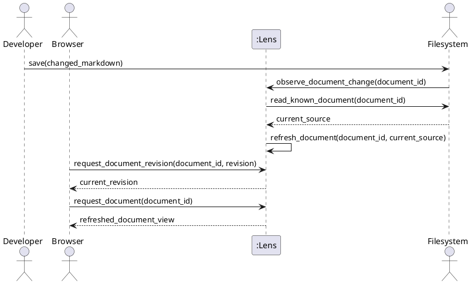

# SSD-04: Refresh a Changed Markdown Document

Use case: `UC-09`

Scenario: A developer saves the currently displayed Markdown document and the
browser receives its new representation without an explicit page reload.

Actors:

- Developer or technical writer
- Operating system browser
- Filesystem

System Events:

1. Filesystem -> Lens: `observe_document_change(document_id)`
2. Browser -> Lens: `request_document_revision(document_id, revision)`
3. Browser -> Lens: `request_document(document_id)`

`observe_document_change(document_id)` represents Lens' session watcher
noticing a difference in an already authorized document. The observer does not
provide an arbitrary path and cannot name a document outside the fixed set.

Discovered System Operations:

- `observe_document_change(document_id)`: replace a known document's rendered
  representation and revision only after successfully reading its changed
  contents.
- `request_document_revision(document_id, revision)`: return the current
  revision for one known document so the browser can decide whether to reload.
- `request_document(document_id)`: return the latest successfully rendered
  representation of one known document.

Extension: If Lens cannot read the changed document, it retains the previously
rendered representation and revision. A browser observing that revision does
not reload the current page.

Trace:

- Requirements: [`FEAT-03`](use-cases.md) (`UC-09`)
- Contract: [`OC-04`](oc-04-refresh-changed-document.md)
- Realization: [`RZ-03`](design.md#rz-03-refresh-and-serve-a-known-document)
