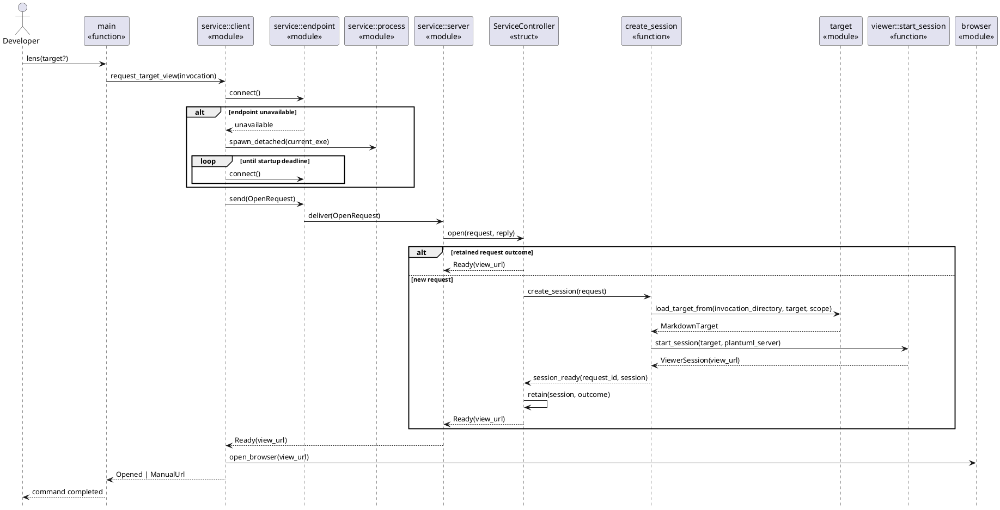

# FEAT-04 Background Viewer Service Design

## At a Glance

An ordinary Lens command becomes a short-lived client. It connects to a local
background Lens process, starting one automatically when needed, and submits
the target in the context of the invoking shell. The background process creates
a fresh viewing session with the same fixed root and document rules Lens uses
today. Once that session's loopback URL is ready, the client opens the URL and
returns the terminal prompt.

The reusable unit is the process, not the viewing-session state. Keeping a
separate listener and `ViewerState` for every accepted command preserves the
current authorization boundary and avoids a global mutable router that could
confuse repositories, target scopes, or PlantUML destinations.

This design realizes [`UC-11`](use-cases.md), [`SSD-07`](ssd-07-request-target-view.md),
and [`OC-07`](oc-07-request-target-view.md). The local IPC and process decisions
are accepted in [ADR-022](../../decisions/adr-022-per-user-background-service.md).

## Representative Scenario

1. The Lens client captures the invoking directory, optional target, scope, and
   raw `LENS_PLANTUML_SERVER` value in an owned `OpenInvocation`.
2. It tries the current user's local endpoint. If no service answers, it starts
   a detached copy of the Lens executable in an internal service mode and
   reconnects until a bounded startup deadline.
3. The client sends one bounded `OpenRequest` containing a new `RequestId` and
   lossless native paths.
4. The background service authorizes the peer and gives the request to its
   state-owning `ServiceController`.
5. For a new request identifier, a session-creation task resolves the target
   relative to the captured invocation directory, normalizes the PlantUML
   server, and starts a new loopback viewing session.
6. The controller retains the `ViewerSession` handle and its ready outcome in
   a process-lifetime `RequestLedger`. A retry with the same identifier receives
   that outcome without creating another listener.
7. The client receives `Ready(view_url)`, asks the operating system to open it,
   and returns. A browser-launch failure instead prints the same URL for manual
   opening while the service continues to host it.

Target or session creation failure returns a typed rejection and creates no
reachable viewing session. Endpoint startup and acknowledgment use bounded
deadlines; they never turn an unknown outcome into reported success.

## Process and Trust Boundaries

- **Lens client:** retains the invoking working directory, environment, terminal
  error reporting, and browser-launch context. It owns no browser-facing server
  state after it exits.
- **Background Lens service:** one process per operating-system user. It owns
  the local command endpoint, request outcomes, and all accepted viewing-session
  handles.
- **Viewing session:** one ephemeral loopback HTTP listener plus a fixed
  `ViewerState`, document watcher, and server task. Its authority never changes
  because another request arrives.
- **Operating system browser:** receives only a loopback URL. It cannot invoke
  the local IPC operation or supply a filesystem path through an HTTP route.

Unix-domain socket permissions and peer credentials establish the Unix user
boundary. An explicit named-pipe access-control list establishes the Windows
user boundary. Target validation still runs for every request; peer identity is
not a substitute for canonicalization or the fixed document set.
The endpoint module fails with actionable guidance when it cannot establish a
verified user-private runtime location or access policy; it never falls back to
a shared writable endpoint.

## Request and Response Boundary

The protocol frame starts with a big-endian 32-bit length and contains one
UTF-8 JSON message encoded from versioned Rust enums and structs. Construction
sets a conservative maximum frame size before any allocation based on peer
input. `serde` and `serde_json` become direct dependencies because Lens uses
their public APIs rather than relying on their current transitive presence.

| Value | Responsibility |
|---|---|
| `ProtocolVersion` | Reject incompatible clients before interpreting request fields. |
| `RequestId` | Distinguish a transport retry from a separately invoked command; generate it through a direct operating-system randomness dependency because collisions would violate session identity. |
| `invocation_directory: WirePath` | Preserve the canonical base for omitted and relative targets. |
| `target: Option<WirePath>` | Preserve the actor-supplied platform-native path without lossy UTF-8 conversion. |
| `scope: TargetScope` | Retain repository or explicit target scope for this session. |
| `plantuml_server: Option<String>` | Carry the invoking command's raw environment value for existing normalization in the background process. |

`WirePath` is a closed platform-tagged value: Unix paths use owned bytes and
Windows paths use owned UTF-16 code units. The decoder accepts only the variant
for the current platform and rejects invalid native path values before target
resolution.

Responses form a closed enum:

- `Ready { request_id, view_url }`: a new listener is ready and its
  `ViewerSession` is retained.
- `Rejected { request_id, error }`: target or session creation failed and no
  URL was published.
- `Incompatible { supported_version }`: the live service cannot safely decode
  this client protocol.

Connection, startup, framing, authorization, and acknowledgment timeout errors
remain client-side failures because no valid service response exists.

## Responsibility Assignment

| Responsibility | Owner | GRASP basis and consequence |
|---|---|---|
| Capture one invocation and complete the system operation | `service::client::request_target_view` | Facade Controller: coordinates endpoint, protocol, browser, and errors without taking target or session rules. |
| Connect, claim, accept, and authorize the per-user endpoint | `service::endpoint` | Protected Variations and Pure Fabrication: isolates the closed Unix/Windows platform difference behind a cohesive module API. |
| Start a detached service candidate | `service::process` | Information Expert: owns executable, standard-I/O, and native process-creation details without coupling them to request handling. |
| Encode and bound messages | `service::protocol` | Information Expert: owns protocol version, native path representation, frame limit, and typed errors. |
| Coordinate request identity and session ownership | `ServiceController` | Use-Case Controller: receives open commands and delegates target/session creation while exclusively owning request and session collections. |
| Recognize retries and retain completed outcomes | `RequestLedger` | Information Expert: owns `RequestId` lookup, in-flight waiters, completed outcomes, and every successful session association for the process lifetime. |
| Create a browser-ready viewing session | `create_session` | Creator: receives all initialization data and composes target resolution with the viewer session starter. It remains a function because it has no independent state. |
| Resolve target and discover authorized documents | `target` module | Information Expert: preserves existing canonicalization, scope, discovery, and error rules. |
| Own listener and task lifetime | `ViewerSession` | Information Expert and Creator: contains the listener-derived URL, viewer state, watcher task, and HTTP task needed to keep one session alive. |
| Build and spawn one session | `viewer::start_session` | Pure Fabrication at the existing composition boundary: creates `ViewerSession` without launching a browser or waiting for Ctrl-C. |
| Select and spawn the browser command | crate-level `browser` module | Information Expert: preserves current platform command construction and manual-URL error boundary for both foreground and client paths. |

No runtime trait is introduced for supported operating systems because the
variation is closed at compile time. Protocol read/write helpers can be generic
over `AsyncRead` and `AsyncWrite` for tests without making the application
store trait objects.

## RZ-04: Request Target View Realization

The realization keeps connection startup in the client, request/session state
in one controller, filesystem expertise in `target`, and browser launch back in
the invoking process. It shows the successful creation path and the retained
outcome path used by a transport retry.



### Extension Collaborations

- **Concurrent first commands:** every client may spawn a candidate. The
  endpoint's atomic claim admits one server; losing candidates exit, and all
  clients reconnect to the winner.
- **Duplicate transport delivery:** `RequestLedger` returns a completed outcome
  or attaches another reply waiter to the in-flight request. The controller
  never calls `create_session` twice for one `RequestId`.
- **Target rejection:** `target` returns its existing typed error;
  `create_session` converts it to `Rejected`; the controller retains that
  outcome for retry but retains no `ViewerSession`.
- **Session task failure before readiness:** `viewer::start_session` returns an
  error before publishing a URL. No session handle enters the controller.
- **Browser launch failure:** the client maps `open_browser` failure to
  `ManualUrl(view_url)`. It neither retries the service request nor destroys the
  accepted session.
- **Service crash:** endpoint ownership and all session handles disappear. A
  later client starts a replacement, while old browser URLs remain unavailable.

## DCD-04: Rust Module and Type View

This view includes only types and modules that receive messages or own state in
RZ-04. It uses Rust stereotypes rather than class inheritance. Dependencies are
one-way toward the existing target and viewer capabilities.

```plantuml
@startuml
hide empty members

package "service" {
  class "client\n<<module>>" as Client {
    +request_target_view(invocation): Result<ClientOutcome, ClientError>
  }

  class "endpoint\n<<module; cfg(unix/windows)>>" as Endpoint {
    ~connect(): Result<Connection, EndpointError>
    ~claim(): Result<Listener, EndpointError>
    ~authorize(connection): Result<(), EndpointError>
  }

  class "process\n<<module; cfg(unix/windows)>>" as Process {
    ~spawn_detached(executable): Result<(), ProcessError>
  }

  class "protocol\n<<module>>" as Protocol {
    ~read_frame(stream): Result<ServiceRequest, ProtocolError>
    ~write_frame(stream, response): Result<(), ProtocolError>
  }

  class "OpenInvocation\n<<struct>>" as Invocation {
    +target: Option<PathBuf>
    +invocation_directory: PathBuf
    +scope: TargetScope
    +plantuml_server: Option<String>
  }

  class "RequestId\n<<newtype>>" as RequestId

  class "OpenRequest\n<<struct>>" as OpenRequest {
    +protocol_version: ProtocolVersion
    +request_id: RequestId
    +invocation_directory: WirePath
    +target: Option<WirePath>
    +scope: TargetScope
    +plantuml_server: Option<String>
  }

  enum WirePath {
    Unix(Vec<u8>)
    Windows(Vec<u16>)
  }

  enum ServiceRequest {
    Open(OpenRequest)
  }

  enum OpenOutcome {
    Ready(ViewUrl)
    Rejected(OpenError)
  }

  enum RequestState {
    InFlight(waiters)
    Complete(OpenOutcome, ViewerSession?)
  }

  class "ServiceController\n<<struct>>" as Controller {
    -requests: RequestLedger
    ~run(receiver): Result<(), ServiceError>
    ~open(request, reply)
  }

  class "RequestLedger\n<<struct>>" as Ledger {
    -entries: IndexMap<RequestId, RequestState>
    +lookup_or_begin(request_id, reply): RequestDisposition
    +complete(request_id, outcome)
  }

  class "create_session\n<<function>>" as Factory {
    +create_session(request): Result<ViewerSession, OpenError>
  }
}

package "target" {
  class "target\n<<module>>" as Target {
    +load_markdown_target_from(directory, target?, scope): Result<MarkdownTarget, TargetError>
  }
}

package "viewer" {
  class "viewer\n<<module>>" as Viewer {
    ~start_session(target, plantuml_server): Result<ViewerSession>
    +serve(target): Result<()>
  }

  class "ViewerSession\n<<struct>>" as Session {
    +view_url(): &str
    +run_until(self, shutdown): Result<()>
    -state: Arc<ViewerState>
    -server_task: JoinHandle
    -watcher_task: JoinHandle
  }

  class "ViewerState\n<<struct>>" as State
}

class "browser\n<<module>>" as Browser {
  ~open_browser(url): Result<(), io::Error>
}

Client ..> Invocation
Client ..> RequestId : creates
Client ..> OpenRequest : converts invocation
Client ..> Endpoint
Client ..> Process
Client ..> Protocol
Client ..> Browser
ServiceRequest --> OpenRequest
OpenRequest --> RequestId
OpenRequest --> WirePath
Protocol ..> ServiceRequest
Protocol ..> OpenOutcome
Controller *-- Ledger : owns
Ledger *-- "0..*" Session : retains ready sessions
Ledger --> RequestState
Controller ..> Factory
Factory ..> Target
Factory ..> Viewer
Viewer ..> Session : creates
Session *-- State : Arc ownership
@enduml
```



## Rust Ownership, Concurrency, and Errors

- `OpenInvocation`, wire messages, outcomes, and errors own their data at
  process and task boundaries. No stored borrow or cross-process lifetime is
  introduced.
- `ServiceController` is one state-owning asynchronous event loop (an actor)
  fed by a multiple-producer, single-consumer (`mpsc`) channel. It exclusively
  owns the request ledger, avoiding an `Arc<Mutex<ServiceState>>` shared across
  connection tasks.
- A new request records an in-flight entry, then runs filesystem discovery and
  session creation outside the controller's state mutation. Completion returns
  through the controller channel so no lock is held across I/O or `.await`.
- The request ledger retains completed successes, rejections, and successful
  session handles for the initial service lifetime. This gives retries exact
  outcomes; C16 measures the resulting growth before any compaction policy is
  introduced.
- Each connection handler owns its stream and a `oneshot` reply path. It
  validates and bounds one frame before giving a typed request to the
  controller.
- `ViewerSession` uses resource acquisition is initialization (RAII): owned
  task handles keep the server and watcher tied to the session handle. Dropping
  a partially created handle aborts its tasks before a URL is published.
- Closed protocol choices use enums and exhaustive matching. Platform endpoint
  implementations use `cfg`, not dynamic polymorphism. Protocol helpers use
  generic I/O bounds only where test substitution requires them.
- Expected target, endpoint, protocol, startup, timeout, and browser failures
  remain typed at their boundaries. `anyhow` may add application context at the
  executable edge without erasing response categories sent across IPC.

## Module Placement

The feature has several concerns that change independently and have distinct
platform dependencies, state, and tests. The initial construction target is:

```text
src/
  browser.rs
  service/
    mod.rs
    client.rs
    endpoint.rs
    process.rs
    protocol.rs
    server.rs
  target.rs
  viewer/
    mod.rs
    ...existing modules...
```

`service/mod.rs` is the intentional capability entry point and re-export
surface, not an implementation dump. `endpoint.rs` and `process.rs` contain
cohesive `cfg` sections unless their platform implementations independently
cross the repository's split signals during construction. `protocol.rs` keeps
message types, lossless native path encoding, frame limits, and framing tests
together. `server.rs` keeps the controller, request ledger, connection handling,
and their concurrency tests together until evidence supports another boundary.

The existing browser code moves mechanically from `viewer::browser` to the
crate-level `browser` module because both foreground `serve` and the new client
use it. Public paths remain intentional: `lens::serve(MarkdownTarget)` keeps its
foreground behavior, while the CLI uses a new high-level open operation. The
internal background-service entry point is hidden from normal help and is not a
supported manual server command.

## Construction and Verification Handoff

Construction should keep one commit per thin implementation iteration:

1. **C10, promote browser launch mechanically:** move the existing browser
   module to the crate level with its tests and preserve every program,
   argument, error, and foreground `serve` call.
2. **C11, extract viewer session startup:** add a failing lifecycle test, then
   introduce `ViewerSession` and `viewer::start_session`; implement the current
   public `serve` through them without changing foreground behavior.
3. **C12, establish the bounded local protocol:** test version, size, malformed
   frame, lossless native path, and typed response behavior with in-memory
   streams.
4. **C13, claim the per-user endpoint:** add platform endpoint, peer
   authorization, stale Unix-socket, detached-candidate, and concurrent-owner
   tests on native runners.
5. **C14, coordinate service requests:** test
   `same_request_retried_then_one_viewing_session_is_retained`,
   `different_requests_then_isolated_sessions_keep_their_roots_and_servers`,
   and `target_rejected_then_no_viewing_session_becomes_reachable`; implement
   the controller and session creation behind the tested protocol.
6. **C15, auto-start and browser handoff:** test
   `missing_service_then_command_starts_service_and_returns_after_view_ready`,
   `concurrent_first_commands_then_one_service_accepts_both_requests`,
   `stale_endpoint_then_next_command_recovers_without_manual_cleanup`, and
   `browser_launch_failure_then_reports_manual_url_and_keeps_session_available`.
   Extend the compiled-browser harness to prove the command exits while its
   page and automatic refresh remain usable.
7. **C16, transition and measurement:** run native Linux, macOS, and Windows
   checks; establish startup, reuse acknowledgment, and failure timeout budgets;
   measure retained-session memory and refresh work; update README, release
   notes, risks, and lifecycle status from proposed to implemented.

Every Rust test follows the repository's behavior-oriented naming and setup,
one primary action, verification structure. Concurrency tests may alternate
actions and assertions when the ordering itself is the behavior. Construction
must run `cargo fmt --check`, `cargo test --locked`,
`cargo clippy --locked --all-targets --all-features -- -D warnings`, and the
complete browser suite after each module split.

## Residual Risks and Deferred Choices

- The concrete frame-size, startup, acknowledgment, and measurement thresholds
  require executable evidence in construction.
- A process crash breaks all URLs it owns; transparent session transfer is out
  of scope.
- An incompatible live service is reported rather than replaced. A future
  upgrade protocol may add graceful handoff if real use demonstrates the need.
- The first implementation retains sessions and request outcomes for the
  background process lifetime. Browser leases, close detection, idle
  retirement, request-ledger compaction, or an explicit stop command require
  separate lifecycle and measurement evidence.
- Native Windows access-control and detached-process behavior cannot be claimed
  from Linux-only CI; release transition requires Windows execution evidence.
