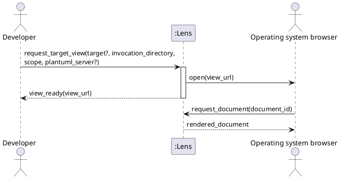

# SSD-07: Request a Target View Without Occupying the Terminal

## Scenario Context

A developer invokes Lens from a working directory with an optional target,
target scope, and PlantUML server environment value. Lens may need to start its
background process or may reuse one that is already available. That distinction
is invisible in the successful interaction: the browser-facing URL is ready,
the browser handoff is attempted, and the command completes without waiting for
the resulting browser view to close.

The background process is inside the Lens system boundary. This system sequence
therefore shows Lens as one black box rather than treating its command-side and
background parts as separate actors.

## Actors

- Developer or technical writer
- Operating system browser

## System Events

1. Developer -> Lens:
   `request_target_view(target?, invocation_directory, scope, plantuml_server?)`
2. Lens -> Operating system browser: `open(view_url)`
3. Lens -> Developer: `view_ready(view_url)`
4. Operating system browser -> Lens: `request_document(document_id)`
5. Lens -> Operating system browser: `rendered_document`

`invocation_directory` is the directory from which the developer ran the
command. It preserves the meaning of an omitted or relative target even though
the long-lived background process has its own process working directory.
`plantuml_server?` is the optional environment value observed by that command;
Lens retains the existing normalization and public-default rules when it
creates the viewing session.

## Discovered System Operations

- `request_target_view(target?, invocation_directory, scope, plantuml_server?)`:
  validate the invocation in its original filesystem context, make an isolated
  browser-facing viewing session available through the background Lens process,
  attempt the browser handoff, and complete the command.
- `request_document(document_id)`: return one document already authorized by
  the viewing session addressed by the browser URL. This existing operation
  remains specified by `FEAT-01` and its contracts.

## Significant Extensions

- A target-validation, background-startup, command-delivery, or acknowledgment
  failure returns `open_failed(reason)` to the developer. Lens opens no browser
  view and does not report the request as accepted.
- If the browser handoff fails after the viewing session becomes available,
  Lens returns `manual_open_required(view_url)` instead of `view_ready`. The
  developer can open the URL manually, and the background process continues to
  host it.
- A diagram or document-time failure after `view_ready` follows the existing
  browser-visible failure behavior; it does not reactivate or block the
  completed command.

## Trace

- Use case: [`FEAT-04`, `UC-11`](use-cases.md)
- Operation contract: [`OC-07`](oc-07-request-target-view.md)
- Existing document operation: [`OC-02`](../markdown-viewing/oc-02-open-document-root.md)
- Analysis iteration: [S2 command and session contract](../../iterations/s2-background-viewer-command-contract.md)
