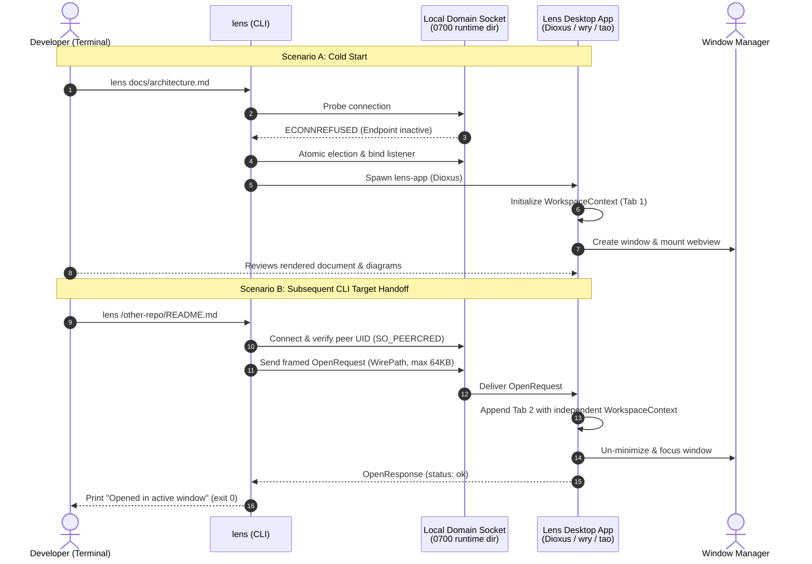

# FEAT-05: Dioxus Desktop Application Specification & Execution Plan

Governed by [ADR-026: Dioxus Desktop Application Shell and In-Process Presentation](../../decisions/adr-026-dioxus-desktop-application.md).

---

## 1. Overview & User Workflow

Lens transitions from ephemeral loopback browser tabs to a single-instance native desktop application built with **Dioxus (`dioxus-desktop`)**. The CLI remains the fast entry point: running `lens <path>` from a terminal either starts the desktop application or forwards the target to the running window via local IPC in under 200ms.

---

## 2. Architecture & System Invariants

### A. Multi-Crate Workspace
* `crates/lens-core`: Pure Rust library for document discovery, root detection, Markdown parsing ([`pulldown-cmark`](../../Cargo.toml#L24)), PlantUML encoding, and cache state. Completely free of GUI or WebKit dependencies.
* `crates/lens-app`: The Dioxus desktop binary containing window management (`tao`), in-process webview (`wry`), reactive tab state, and background coroutines.
* `crates/lens-cli`: The lightweight CLI dispatcher that coordinates atomic startup elections, forwards requests over IPC, or falls back to headless mode.

### B. Single-Instance IPC & Endpoint Security
* **Location:** Resides in a verified user-owned private directory (`0700`) at `$XDG_RUNTIME_DIR/lens/lens.sock` (or `/tmp/lens-$UID/lens.sock` on POSIX, `\\.\pipe\lens-$USERNAME` on Windows with current-user ACL).
* **Peer Authentication:** Server and client verify operating-system peer credentials (`SO_PEERCRED` on Linux, `getpeereid` on macOS) before exchanging payloads, rejecting connections from differing UIDs.
* **Bounded Framing:** Communication uses 4-byte big-endian length-prefixed framing with a hard limit of `MAX_FRAME_BYTES = 64 * 1024` (64 KB). Oversized or malformed frames are rejected immediately without unbounded buffering.
* **Lossless Paths:** Filesystem paths are serialized via `WirePath::Unix(Vec<u8>)` and `WirePath::Windows(Vec<u16>)`, preserving non-UTF-8 bytes and unpaired UTF-16 surrogates without lossy string conversion.

### C. In-Process Presentation & Security Boundaries
* **Per-Tab Workspace Isolation:** Each tab owns an independent `WorkspaceContext` (`document_root`, `discovered_documents`, `source_link_resolver`, `scope`, `plantuml_server`). Opening documents across different repositories retains strict project-level isolation without cross-repo link pollution.
* **Passive Diagram Boundary:** PlantUML SVGs are fetched asynchronously and rendered strictly behind a passive `` element (e.g. `data:image/svg+xml;base64,...`). SVGs are never injected as raw markup into the live DOM, neutralizing active script execution and DOM event handlers.
* **Offline Mermaid:** Bundled `mermaid.min.js` is injected into the webview at startup and executed client-side via Dioxus DOM evaluation hooks (`document::eval`) on document mount.

### D. Platform Display Detection
* **Linux:** Checks `$DISPLAY` and `$WAYLAND_DISPLAY`. If both are unset (e.g., SSH session, headless container), Lens aborts with an actionable error directing the user to `--server`.
* **macOS & Windows:** Uses native platform GUI availability. macOS desktop launches do not require or inspect `DISPLAY` or `WAYLAND_DISPLAY`.
* **Headless Fallback:** Running `lens --server [TARGET]` starts the headless loopback HTTP server in any environment.

---

## 3. Business Rules & Concrete Scenarios

* **R1 (Single Instance & Stale Recovery):** Exactly one application window runs per user. If an existing socket connection fails with `ECONNREFUSED`, Lens verifies ownership, unlinks the stale file, and binds a new listener.
* **R2 (Atomic Startup Election):** Concurrent `lens` commands coordinate startup atomically: the winner binds the listener and launches the window; losers await readiness with exponential backoff (up to 5s) and forward their targets as clients.
* **R3 (Target Handoff & Focus):** Forwarding a target opens a new tab or switches focus to an already-open tab, and brings the window to the foreground.
* **R4 (Multi-Repo Tab Isolation):** Tab 1 (Repo A) and Tab 2 (Repo B) resolve relative links strictly against their respective repository roots.
* **R5 (Passive SVG Sanitization):** Diagram responses containing `<script>` or event handlers cannot execute or access the DOM.

---

## 4. Work Packages & Execution Slices

### Slice 1: Modular Crate Extraction (`crates/lens-core`)
- [ ] **Task 1.1:** Restructure repository as a Cargo workspace with root `Cargo.toml`.
- [ ] **Task 1.2:** Extract `lens-core` containing `discovery`, `markdown`, `plantuml`, and `source_link` without GUI dependencies.
- [ ] **Task 1.3:** Verify all existing unit tests pass under `lens-core` (`cargo test -p lens-core --locked`).

### Slice 2: Local IPC Protocol & Single-Instance Listener (`crates/lens-ipc`)
- [ ] **Task 2.1:** Implement 4-byte length-prefixed framing (64 KB bound) and lossless `WirePath` representation.
- [ ] **Task 2.2:** Implement private runtime directory (`0700`) and OS peer UID verification (`SO_PEERCRED` / `getpeereid` / Windows ACL).
- [ ] **Task 2.3:** Implement atomic startup election, stale socket recovery, and client retry with backoff.
- [ ] **Task 2.4:** 3A Unit Tests:
  - `unreachable_stale_socket_then_recovers_and_binds_new_listener`
  - `active_server_then_receives_and_acknowledges_open_target_message`
  - `peer_uid_mismatch_then_rejects_connection_before_payload`
  - `oversized_frame_exceeding_64kb_then_rejects_immediately_without_buffering`
  - `native_path_with_non_utf8_bytes_or_unpaired_surrogates_then_roundtrips_losslessly`
  - `simultaneous_cold_starts_then_elects_single_server_and_forwards_second_target`

### Slice 3: Dioxus Desktop Application Shell & Tab Isolation (`crates/lens-app`)
- [ ] **Task 3.1:** Initialize `crates/lens-app` with `dioxus` (0.5+), `dioxus-desktop`, and `lens-core`.
- [ ] **Task 3.2:** Implement reactive state with per-tab `WorkspaceContext`:
  - `AppState { tabs, active_tab_index, drawer_open }`
  - `TabState { id, file_path, title, rendered_html, scroll_offset, workspace: Arc<WorkspaceContext> }`
- [ ] **Task 3.3:** Build UI component hierarchy (`AppShell`, `TabBar`, `DocumentViewer`, `NavigationDrawer`).
- [ ] **Task 3.4:** Mount IPC listener coroutine to receive `OpenRequest`, switch/append tabs, and focus window.
- [ ] **Task 3.5:** Mount file-watcher coroutine to live-reload changed documents without resetting scroll.
- [ ] **Task 3.6:** Tab Isolation Test:
  - `tabs_from_distinct_repositories_then_retain_independent_document_roots_and_link_resolution`

### Slice 4: In-Process Diagram Rendering & Passive PlantUML Boundary (`crates/lens-app`)
- [ ] **Task 4.1:** Bundle `mermaid.min.js` and inject via `with_initialization_script`.
- [ ] **Task 4.2:** Implement Dioxus `use_effect` hook to trigger `mermaid.run()` on mount and tab switch.
- [ ] **Task 4.3:** Fetch PlantUML SVGs asynchronously and embed strictly behind passive `` elements (`data:image/svg+xml;base64,...`).
- [ ] **Task 4.4:** Security Test:
  - `plantuml_svg_with_active_scripts_then_rendered_behind_passive_img_without_script_execution`

### Slice 5: CLI Dispatcher & Platform Display Detection (`crates/lens-cli`)
- [ ] **Task 5.1:** Update CLI arguments to support `lens [TARGET]`, `lens stop`, and `--server`.
- [ ] **Task 5.2:** Implement dispatch logic:
  - If `--server`: start headless loopback HTTP server.
  - On Linux: if `DISPLAY` and `WAYLAND_DISPLAY` are unset, exit 1 with hint to use `--server`.
  - On macOS/Windows: use native GUI availability without inspecting display variables.
  - Otherwise: send `OpenRequest` over IPC; if no server running, elect leader and launch `lens-app`.
- [ ] **Task 5.3:** Integration Tests:
  - `cli_invoked_without_active_app_then_starts_desktop_window`
  - `cli_invoked_with_active_app_then_forwards_target_and_exits_zero`
  - `macos_desktop_launch_with_unset_display_variables_then_succeeds`
