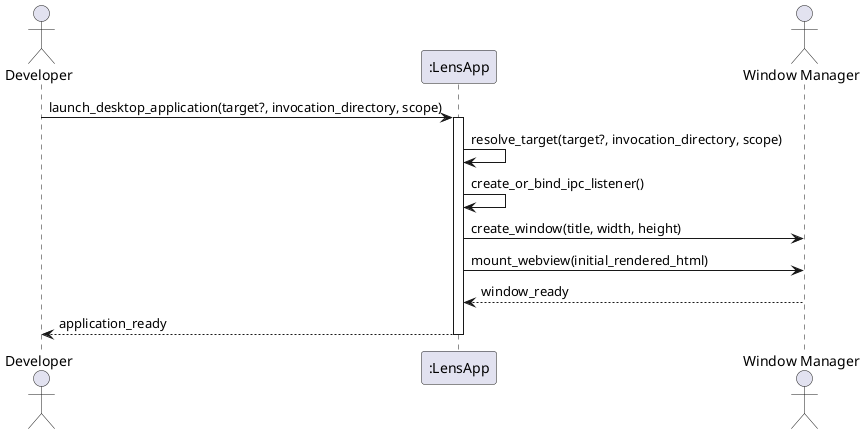

# SSD-08: Launch Desktop Application

## Scenario Context

When no desktop instance of Lens is active for the invoking user, executing `lens [TARGET]` or opening the application from the desktop launcher starts the Dioxus desktop window. Lens validates the target, establishes the local single-instance IPC listener, creates the native window, and renders the initial document in-process.

## Actors

- Developer or Technical Writer
- Desktop Window Manager

## System Events

1. Developer -> App: `launch_desktop_application(target?, invocation_directory, scope)`
2. App -> App: `resolve_target(target?, invocation_directory, scope)`
3. App -> App: `create_or_bind_ipc_listener()`
4. App -> Window Manager: `create_window(title, width, height)`
5. App -> Window Manager: `mount_webview(initial_rendered_html)`
6. Window Manager -> App: `window_ready`
7. App -> Developer: `application_ready`
