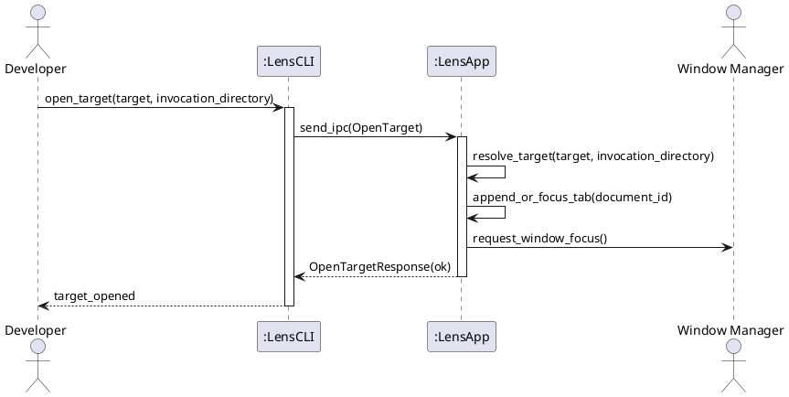

# SSD-09: Command-Line Target Handoff

## Scenario Context

When a Lens desktop window is already running, a subsequent CLI command forwards the target to the running instance over the local IPC socket, requests window focus, and returns control to the shell immediately.

## Actors

- Developer or Technical Writer
- Desktop Window Manager

## System Events

1. Developer -> CLI: `open_target(target, invocation_directory)`
2. CLI -> App: `send_ipc(OpenTarget)`
3. App -> App: `resolve_target(target, invocation_directory)`
4. App -> App: `append_or_focus_tab(document_id)`
5. App -> Window Manager: `request_window_focus()`
6. App -> CLI: `OpenTargetResponse(ok)`
7. CLI -> Developer: `target_opened`
