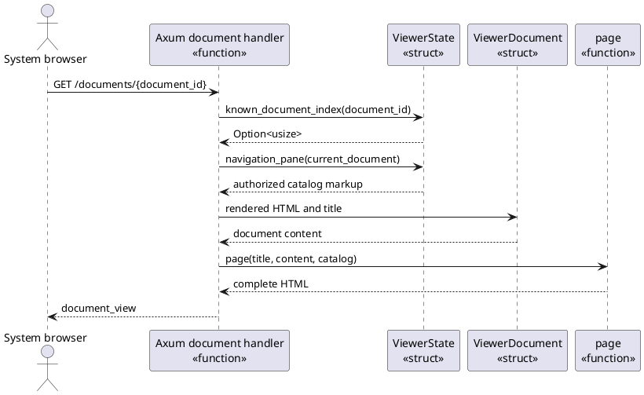
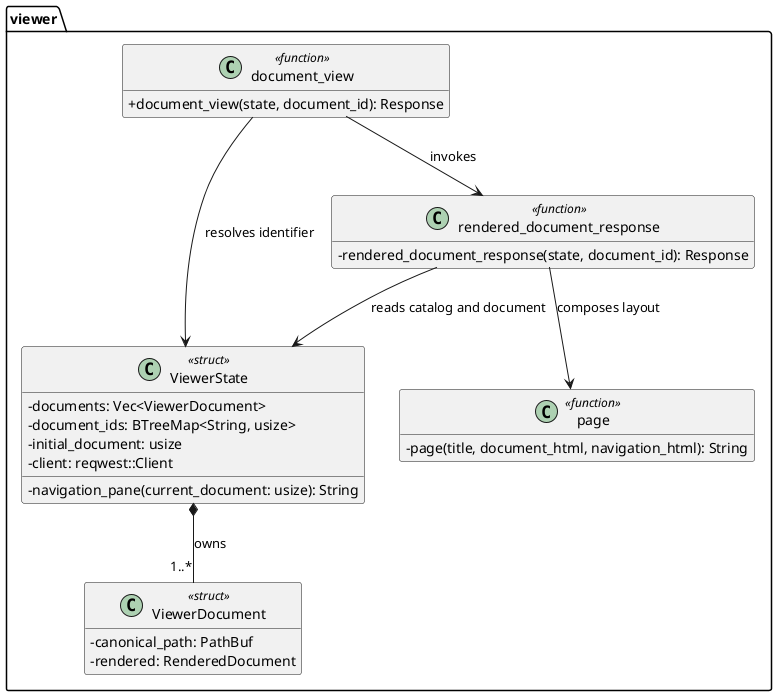

# FEAT-02 Navigation Pane Design

Status: implemented in C3

This design realizes `UC-07` and `UC-08` by reusing the document set that
already authorizes `UC-04`. The source file is a cohesive extension to the
existing viewer module: it adds page composition and browser behavior, not a
new filesystem or network boundary.

## RZ-02: Return a Document with Its Authorized Catalog

Use-case realization: `UC-07` and `UC-08`

System operation: `request_document(document_id)`

Collaborators:

- The Axum document handler is the thin controller for `request_document`; it
  resolves a browser-provided identifier only through `ViewerState`.
- `ViewerState` is the information expert for the ordered document identifiers
  and the current document's index. It produces catalog markup only from that
  in-memory state.
- `ViewerDocument` remains the owner of the cached rendered Markdown and its
  canonical display path.
- `page` is a stateless layout function that composes already escaped document
  and navigation markup into the response.
- Browser script filters the delivered catalog in place. It owns no document
  data beyond the markup in the current page and makes no network request.

Responsibility Decisions:

| Responsibility | Chosen owner and GRASP basis | Coupling and cohesion check |
|---|---|---|
| Resolve a requested identifier | `ViewerState`, Information Expert | The state already owns `document_ids`; another resolver would duplicate the authorization map. |
| Produce the session catalog and active marker | `ViewerState::navigation_pane`, Information Expert | Keeps identifier order, routes, and current identity near the same immutable session state. |
| Dispatch the browser request | Existing Axum handler, Controller | It coordinates lookup and response composition without gaining filesystem or rendering policy. |
| Compose the outer page layout | `page`, Pure Fabrication | A stateless function avoids turning HTML layout into a second session owner. |
| Filter visible catalog entries | Browser script, Information Expert | The browser already owns the displayed identifiers; a server query would add a needless route and request surface. |

The closed variation set is one browser page layout and one session model; no
trait, strategy, or new abstraction is justified. If a later proposal needs
server-side content search or alternate navigation sources, it must introduce a
separate authorization and query design.

## DCD-02: Rust Design View

Rust adaptation notes:

- `ViewerState::navigation_pane(&self, current_document: usize) -> String` is
  an inherent method because the state owns the complete, ordered authorization
  map. It observes immutable session state and creates no new shared resource.
- The response helper and `page` remain private free functions because their
  work is stateless composition, not an invariant-bearing type.
- `Arc<ViewerState>` remains the session-sharing boundary imposed by Axum;
  catalog generation borrows it immutably and does not add locking or mutation.
- The feature uses the existing concrete session types. A trait would be an
  unearned variation point because catalog source selection is fixed by
  ADR-003.

## Construction Result

- `ViewerState::navigation_pane` now derives escaped catalog markup from its
  immutable `document_ids` map and `rendered_document_response` passes it to
  `page`.
- The response renders an accessible navigation landmark, labelled client-side
  filter, live result-status element, and exactly one `aria-current="page"`
  marker. Without scripting, a `noscript` explanation leaves all links usable.
- The existing browser script filters only rendered catalog entries. The
  stylesheet makes the catalog a sticky sidebar on wide viewports and returns
  it to normal flow on narrow viewports.
- Unit and `BTE-01` browser tests verify known-set membership, escaped
  identifiers, active state, local filtering, selection, and exclusion of a
  hidden document.
