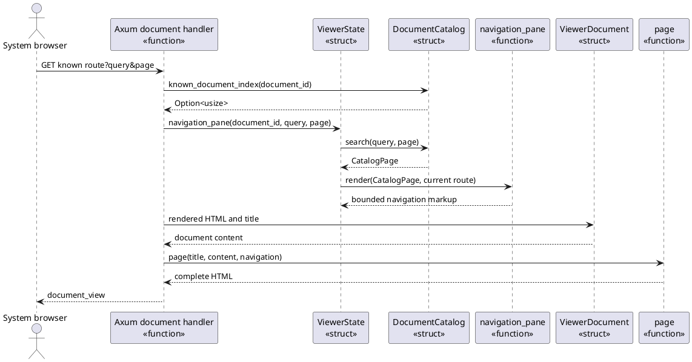
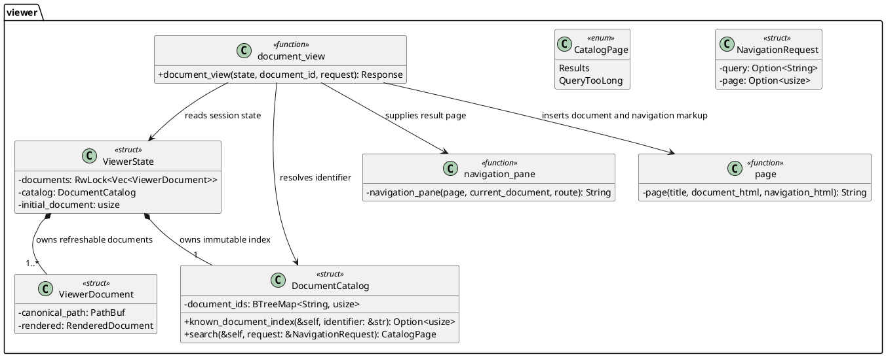

# FEAT-02 Navigation Pane Design

Status: implemented in C3; scalable search designed in N4 and implemented in
C5; collapsible pane implemented in C6

This design refines `UC-07` and `UC-08` under ADR-008. The session still owns
the only authorized document set, but each response presents a bounded search
page instead of the complete catalog. The search index is an immutable value
built while the viewing session starts; it is not a filesystem, content-search,
or background-request capability.

## RZ-02: Return a Document with a Bounded Authorized Catalog Page

Use-case realization: `UC-07` and `UC-08`

System operation: `request_document(document_id, query?, page?)`

Collaborators:

- The Axum document handler remains the thin controller for
  `request_document`. It extracts browser query parameters but resolves a
  document identifier only through `DocumentCatalog`.
- `DocumentCatalog` is the information expert for the immutable identifier
  index. It resolves known identifiers and returns an owned, at-most-50-item
  `CatalogPage` without reading files or documents.
- `ViewerState` owns the catalog and the refreshable document representations.
  It coordinates page composition without making query parameters part of
  authorization or refresh state.
- `navigation_pane` is a stateless layout function. It escapes the supplied
  results, renders the native GET form and page links, and has no document-set
  ownership.
- `ViewerDocument` remains the owner of cached rendered Markdown and its
  canonical display path.

Responsibility Decisions:

| Responsibility | Chosen owner and GRASP basis | Coupling and cohesion check |
|---|---|---|
| Resolve a requested document identifier | `DocumentCatalog`, Information Expert | Its `BTreeMap` is the one session index that maps authorized identifiers to document indices. |
| Select a bounded, case-insensitive result page | `DocumentCatalog`, Information Expert | It searches immutable identifier data and returns only owned result values, so neither handlers nor templates need map or paging logic. |
| Dispatch a browser document request | Existing Axum handler, Controller | It coordinates extraction, lookup, and response composition without gaining filesystem, search, or rendering policy. |
| Render the form, status, and links | `navigation_pane`, Pure Fabrication | A stateless function keeps HTML escaping and presentation separate from the authorization index. |
| Own searchable session data | `ViewerState`, Creator | Session construction already has every authorized `MarkdownDocument`; it creates one `DocumentCatalog` and shares it immutably through `Arc<ViewerState>`. |

The identifier source, matching rule, and pagination variation set are closed
for this feature. A trait or asynchronous search service would add an unearned
variation point. `DocumentCatalog`, `CatalogPage`, and their focused tests have
their own state and helpers, while loopback routes and document rendering
change independently; therefore C5 will place them in
`src/viewer/catalog.rs`. Proposal 13 later separated the independently changing
Axum controllers, session state, and page composition into `viewer::routes`,
`viewer::state`, and `viewer::page`, with `src/viewer/mod.rs` as their thin
composition root.

## DCD-02: Rust Design View

Rust adaptation notes:

- `DocumentCatalog` is a concrete `struct` because its ordered map and paging
  rules form one immutable session value. Its `&self` methods neither lock nor
  mutate session state.
- `NavigationRequest` and `CatalogPage` are small owned values at the HTTP
  boundary. Owned result identifiers avoid borrowing the index across page
  composition and keep the `RwLock` limited to refreshable documents.
- `navigation_pane` remains a private free function because it has no invariant
  bearing receiver; `document_view` remains a thin async controller function.
- `DocumentCatalog`, `document_view`, and `navigation_pane` live with their
  helpers and tests in the cohesive `viewer::catalog`, `viewer::routes`, and
  `viewer::page` modules. This isolates independently changing search,
  transport, and presentation concerns without pass-through modules or traits.

## Construction Targets

- Replace client-side filtering and the complete identifier list with a native
  form, result status, and previous/next links that retain `query` and `page`.
- Build `DocumentCatalog` once from the already authorized identifiers. Verify
  exact 50-item bounds, lexical empty-query paging, case-insensitive matching,
  over-limit query handling, and unknown-document guidance.
- Add browser evidence using more than 50 known documents. Verify a submitted
  search and next-page link work with JavaScript disabled, and that an excluded
  document never appears or becomes reachable.
- Keep refresh and diagram script behavior unchanged except for removing the
  obsolete client-side catalog filter.

## Construction Result

- `viewer::catalog::DocumentCatalog` now owns the immutable `BTreeMap` built
  from the session's already authorized identifiers. It resolves document IDs
  and returns owned, capped search-page values without filesystem access or
  document-content reads.
- The Axum document routes parse only `query` and `page` parameters, then keep
  identifier lookup separate from page selection. The native GET form and page
  links render at most 50 authorized identifiers and retain the selected query.
- The former input-event filter is removed from the browser script. Diagram
  failure handling and current-document refresh polling are unchanged.
- Unit tests cover the result cap, case-insensitive matching, over-limit query,
  and invalid-page behavior. `BTE-01` verifies submitted search and pagination
  with JavaScript disabled against 51 matching fixture documents.

## RZ-04: Toggle Navigation Presentation Without Changing the Session

Use-case realization: `UC-11`

The server-rendered page supplies the navigation pane with a stable ID and a
button outside that pane. The button starts hidden so a browser without
scripting retains a complete, usable navigation pane instead of an inert
control. When the application script loads, it reveals the button and applies
the remembered state.

The application script owns the presentation preference. It stores only a
Boolean in the browser tab's temporary storage (`sessionStorage`) under the
current loopback origin, so it persists through ordinary document navigation
in that tab but does not become server-side `ViewerState`. The script toggles
the pane's `hidden` property, synchronizes the button's `aria-expanded` value
and label, and marks the page layout as collapsed so the document column can
grow. If storage is unavailable, the current page still toggles and later pages
fall back to the visible default.

`navigation_pane`, `DocumentCatalog`, the Axum handlers, and known-document
routes keep their existing responsibilities. They receive no visibility input,
make no new request, and never change the authorized identifier set. The
button remains outside the hidden pane, which preserves a keyboard-reachable
restore path.
