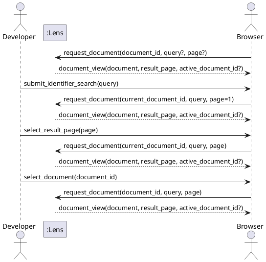

# SSD-03: Search an Authorized Document Catalog

Use cases: `UC-07` and `UC-08`

Scenario: The developer opens a document, submits an identifier search, moves
through a bounded result page, and opens another known document.

Actors:

- Developer or technical writer
- Operating system browser

System Events:

1. Browser -> Lens: `request_document(document_id, query?, page?)`
2. Lens -> Browser: `document_view(document, result_page, active_document_id?)`
3. Browser -> Lens: `request_document(document_id, query, page)` for a page or
   document selection
4. Lens -> Browser: `document_view(document, result_page, active_document_id?)`

The user's text entry remains inside the browser. A Lens system event occurs
only when the user submits the native form or follows a page or document link.
The request identifies a known document separately from `query` and `page`, so
the search values never become a filesystem path.

Discovered System Operations:

- `request_document(document_id, query?, page?)`: return a known document and
  a bounded page of matching identifiers from the immutable session catalog.

Extensions:

- If `document_id` is unknown to the viewing session, Lens returns the existing
  guidance response. It does not return a catalog entry or attempt a filesystem
  lookup.
- If `query` exceeds 256 UTF-8 bytes, Lens returns the document and a visible
  limit message without searching the index.
- If `page` is missing, zero, malformed, or out of range, Lens returns the
  first matching page.

Trace:

- Requirements: [`FEAT-02`](use-cases.md) (`UC-07`, `UC-08`)
- Contract: [`OC-03`](oc-03-request-document-catalog.md)
- Realization: [`RZ-02`](design.md#rz-02-return-a-document-with-a-bounded-authorized-catalog-page)
