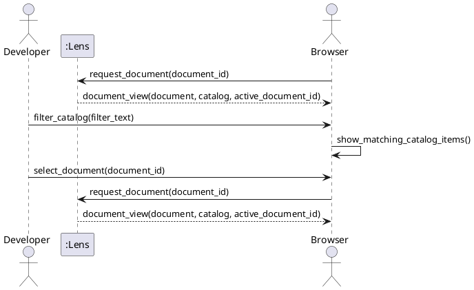

# SSD-03: Browse an Authorized Document Catalog

Use cases: `UC-07` and `UC-08`

Scenario: The developer opens a document, recognizes the active document in
the session's catalog, filters that catalog locally, and opens another known
document.

Actors:

- Developer or technical writer
- Operating system browser

System Events:

1. Browser -> Lens: `request_document(document_id)`
2. Lens -> Browser: `document_view(document, catalog, active_document_id)`
3. Browser -> Lens: `request_document(document_id)` for a catalog selection
4. Lens -> Browser: `document_view(document, catalog, active_document_id)`

The user's filter action is intentionally not a Lens system event. The browser
filters identifiers already present in the delivered catalog; it sends no query
and provides no path for Lens to interpret.

Discovered System Operations:

- `request_document(document_id)`: return a known document together with the
  complete catalog of known document identifiers and the identifier of the
  returned document.

Extension: If `document_id` is unknown to the viewing session, Lens returns
the existing guidance response. It does not return a catalog entry or attempt a
filesystem lookup.

Trace:

- Requirements: [`FEAT-02`](use-cases.md) (`UC-07`, `UC-08`)
- Contract: [`OC-03`](oc-03-request-document-catalog.md)
- Realization: [`RZ-02`](design.md#rz-02-return-a-document-with-its-authorized-catalog)
