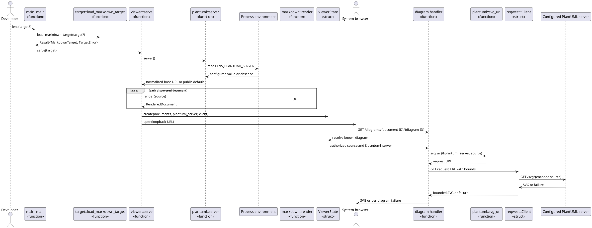
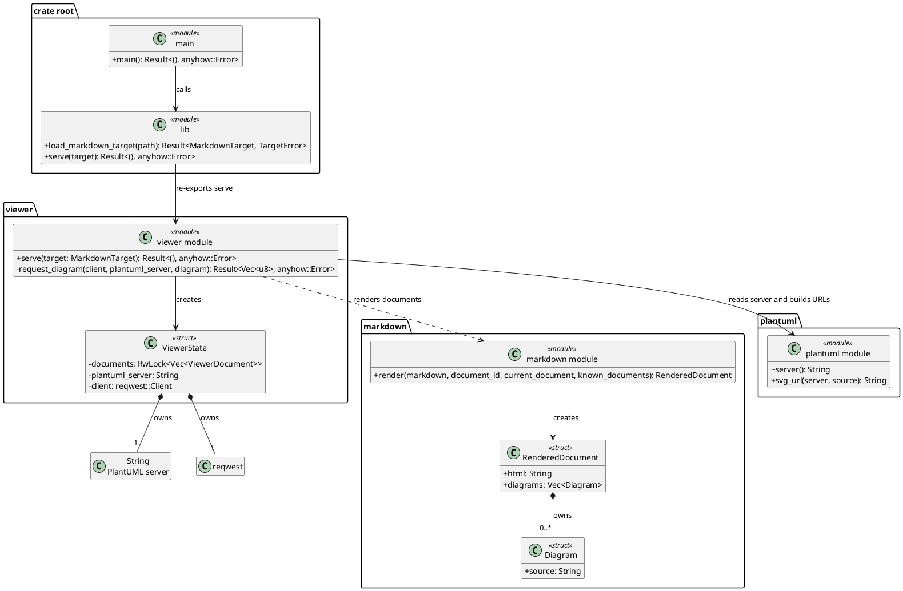

# Server-Only PlantUML Rendering Design

Status: implemented in C7

This design realizes `UC-01` and `UC-10` from
[`FEAT-01`](use-cases.md), the diagram request in
[`SSD-01`](ssd-01-open-markdown-target.md), and the guarantees in
[`OC-05`](oc-05-request-diagram.md). It is the target replacement for renderer
selection and the session-disable portions of the current implementation
snapshot in [`uml-design.md`](uml-design.md).

## RZ-05: Start a Session and Request a Diagram from Its PlantUML Server

Failure realization:

- If a non-empty configured server value cannot produce a valid bounded SVG,
  the handler returns the existing per-diagram failure. It does not call
  `plantuml::server` again and cannot select the public default.
- A retry repeats the same Lens-owned diagram route and therefore derives its
  request URL from the same authorized source and session-owned destination.
- There is no renderer-disable system event or browser route.

Responsibility notes:

- `main::main` is the controller for the command invocation. Removing its
  renderer parameter lets the command parser reject every former `--renderer`
  form before it creates a target or viewing session.
- `plantuml::server` is the information expert for the environment-variable
  name, normalization rule, and public default.
- `viewer::serve` is the creator for `ViewerState` because it has the resolved
  target, normalized server, and HTTP client needed to establish the session.
- `ViewerState` owns the server string because its lifetime and immutability
  match the viewing session. It does not need an atomic rendering flag.
- `markdown::render` owns document parsing and authorized diagram-source
  discovery but knows nothing about server configuration. The diagram handler
  combines that stored source with the server borrowed from `ViewerState`; it
  never accepts either value from the browser.

## DCD-04: Rust Module and Type Target

Rust adaptation:

- The single server path is a concrete value, not an open or closed family of
  rendering algorithms. A `String` owned by `ViewerState` plus cohesive
  `plantuml` module functions is the smallest native mechanism.
- `RendererMode` and the multi-variant `DiagramRenderer` enum are removed
  rather than replaced by a one-variant type or trait.
- `serve(target)` reads process configuration once at the composition root.
  The request function borrows its server and diagram values for temporary
  collaboration; no stored borrow or new lifetime parameter is required.
- Existing `RwLock` ownership for refreshable documents remains. Removing
  session disable also removes the renderer-specific `AtomicBool`; network I/O
  continues without holding the document lock.

## Construction Result

- CLI parsing, public re-exports, and call-site parameters for `RendererMode`
  were removed. `serve(target)` is enforced by a compile-time function bound.
- `plantuml` now owns only server normalization and source encoding.
- `ViewerState` owns the normalized server string and lends it only while
  requesting a diagram. Markdown rendering and refresh have no server
  dependency.
- The ten-second timeout, 2 MiB response limit, SVG checks, source fallback,
  and retry behavior remain covered by Rust and browser tests.
- The local-command branch, Tokio process features, disable route and state,
  disable markup, client script, styling, and mode-specific tests were removed.
- [`C7`](../../iterations/c7-server-only-plantuml-rendering.md) records the
  red-green evidence and full verification result.
