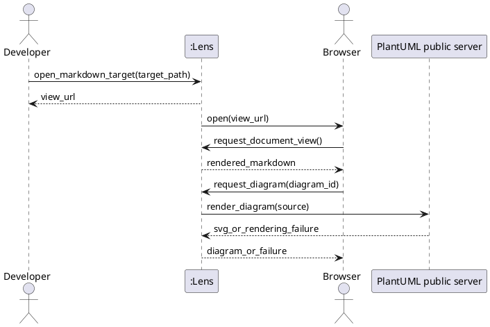

# SSD-01: Open a Markdown Target

Use case: `UC-01`, View a Markdown File with PlantUML Blocks

Scenario: The developer opens a readable Markdown file that contains one or
more PlantUML blocks.

Actors:

- Developer or technical writer
- Operating system browser
- PlantUML public server

System Events:

1. Developer -> Lens: `open_markdown_target(target_path)`
2. Lens -> Developer: `view_url` when automatic browser opening is unavailable.
3. Browser -> Lens: `request_document_view()`
4. Browser -> Lens: `request_diagram(diagram_id)` for each recognized PlantUML
   block.

Discovered System Operations:

- `open_markdown_target(target_path)`: resolve one Markdown file, create a
  local viewing session, and make its local URL available.
- `request_document_view()`: return the selected document with Markdown
  rendered and recognized PlantUML blocks represented as diagrams.
- `request_diagram(diagram_id)`: retrieve one selected diagram from the public
  renderer without exposing an arbitrary file or URL request surface.

Extension: If target validation fails, `open_markdown_target(target_path)`
returns an actionable error and creates no viewing session. If diagram rendering
fails, `request_diagram(diagram_id)` returns a rendering failure; the browser
keeps the original PlantUML source visible.
