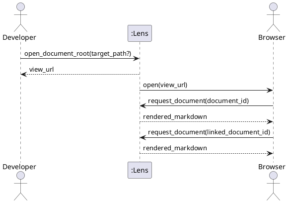

# SSD-02: Open and Navigate a Document Root

Use cases: `UC-02`, `UC-03`, and `UC-04`

Scenario: The developer opens a document root and follows a link to another
discovered Markdown document.

Actors:

- Developer or technical writer
- Operating system browser

System Events:

1. Developer -> Lens: `open_document_root(target_path?)`
2. Lens -> Developer: `view_url` when automatic browser opening is unavailable.
3. Browser -> Lens: `request_document(document_id)`
4. Browser -> Lens: `request_document(linked_document_id)`

Discovered System Operations:

- `open_document_root(target_path?)`: resolve an authorized root, identify its
  Markdown documents, select an initial document, and make a viewing session
  available.
- `request_document(document_id)`: return one document known to the current
  viewing session.

Extension: If `document_id` is unknown to the viewing session, Lens returns a
guidance response and does not interpret the request as a filesystem path.
