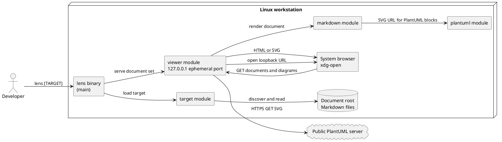
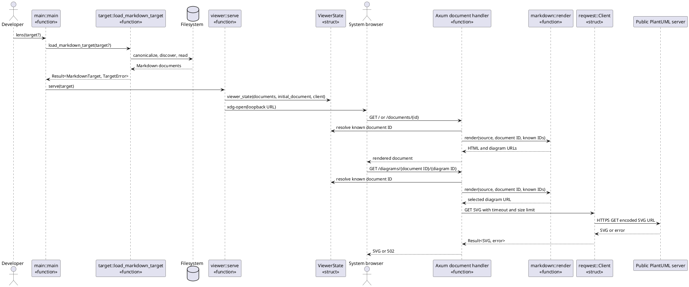
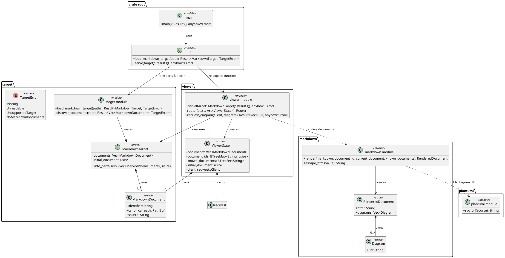

# V1 UML Design Views

Status: V1 implementation snapshot

These diagrams complement the black-box [SSD-01](ssd-01-open-markdown-target.md)
and [SSD-02](ssd-02-open-document-root.md). They show the implemented Rust
modules, owned state, and runtime collaborators for developer discussion. They
do not introduce additional behavior or abstractions.

## CMP-01: Component and Deployment View

The browser reaches only the local viewer. The viewer resolves document routes
only through its discovered document set, then retrieves PlantUML SVG through
the public renderer.

## RZ-01: Open and Navigate a Document Root

Use-case realization: `UC-02`, `UC-03`, and `UC-04`

Responsibility notes:

- `main` is the process boundary: it parses the CLI target once and delegates.
- `target` is the information expert for canonicalization and document discovery.
- `ViewerState` owns the in-memory document set and identifier lookup tables.
- `markdown::render` is a stateless transformation; it rewrites only known
  document links and creates document-scoped diagram URLs.
- The diagram handler re-renders the selected document to obtain a deterministic
  diagram URL rather than storing mutable diagram state.

## DCD-01: Rust Module and Type View

Rust adaptation notes:

- The diagram uses `<<module>>` for cohesive free functions and `<<struct>>` or
  `<<enum>>` only for actual Rust types.
- Composition denotes owned fields. Dependencies denote parameter-only or
  function-call collaboration.
- `MarkdownTarget::into_parts(self)` consumes the target at the transition to
  the viewer, making the ownership transfer explicit.
- There are no traits because renderer, target, and viewer variation points are
  not open in V1.
