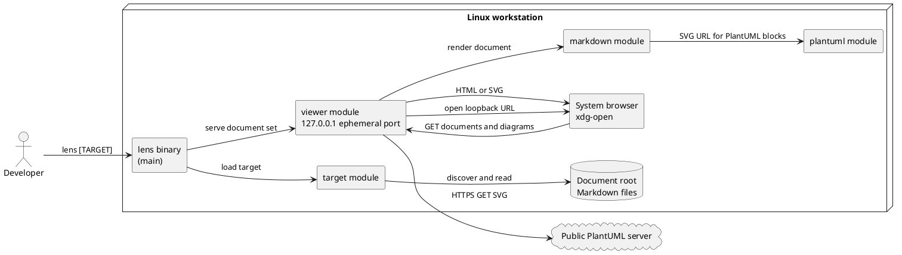
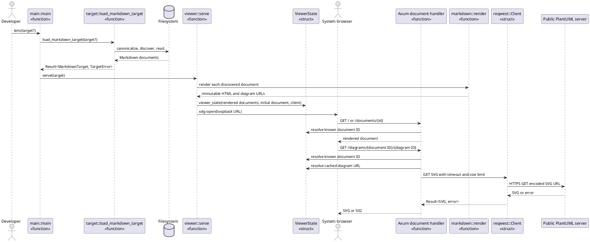
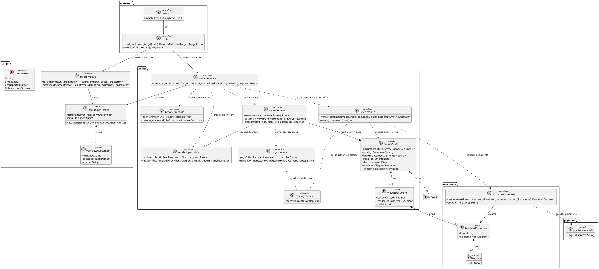

# Viewer UML Design Views

Status: target implementation design for proposal 13

These diagrams complement the black-box [SSD-01](ssd-01-open-markdown-target.md)
and [SSD-02](ssd-02-open-document-root.md). They show the runtime collaborators
and the Rust modules selected for proposal 13, including owned state. They do
not introduce additional behavior or abstractions.

## CMP-01: Component and Deployment View

The browser reaches only the local viewer. The viewer resolves document routes
only through its discovered document set, then retrieves PlantUML SVG through
the public renderer.

## RZ-01: Open and Navigate a Document Root

Use-case realization: `UC-02`, `UC-03`, and `UC-04`

Responsibility notes:

- `main` is the process boundary: it parses the CLI target once and delegates.
- `target` is the information expert for canonicalization and document discovery.
- `ViewerState` owns pre-rendered documents and identifier lookup tables.
- `markdown::render` is a stateless transformation; it rewrites only known
  document links and creates document-scoped diagram URLs.
- Diagram URLs are computed once at session creation and remain immutable for
  the session lifetime.

## DCD-01: Rust Module and Type View

Rust adaptation notes:

- The diagram uses `<<module>>` for cohesive free functions and `<<struct>>` or
  `<<enum>>` only for actual Rust types.
- Composition denotes owned fields. Dependencies denote parameter-only or
  function-call collaboration.
- `MarkdownTarget::into_parts(self)` consumes the target at the transition to
  the viewer, making the ownership transfer explicit.
- `ViewerState` remains one session-owned, cross-task value behind `Arc`; its
  document collection stays behind `RwLock`, and the session disable flag stays
  atomic. The split does not add locks or hold a lock across an `.await`.
- The viewer module is the composition root. Route functions coordinate Axum
  requests, while state, page, rendering, catalog, and browser modules own their
  existing specialized behavior and tests.
- JavaScript and CSS remain compile-time-owned data included by the page module
  from dedicated asset files; they do not become runtime filesystem inputs.
- There are no new traits because the renderer alternatives remain the existing
  closed `DiagramRenderer` enum, and the extracted modules introduce no new
  runtime variation point.
