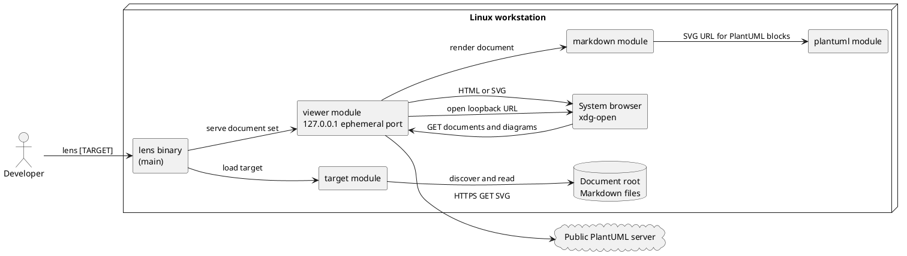
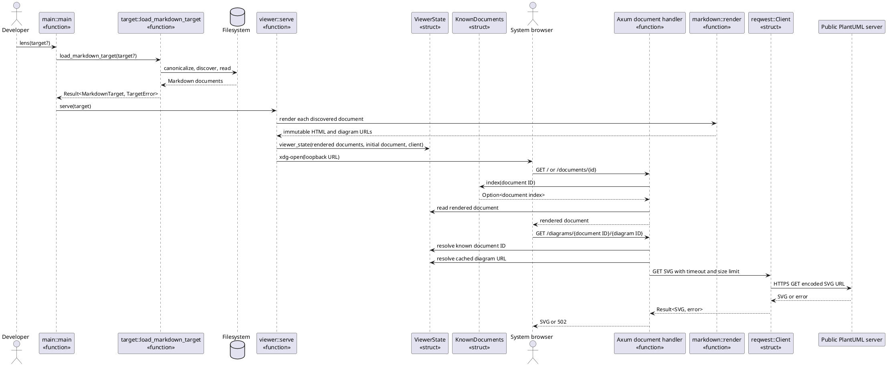
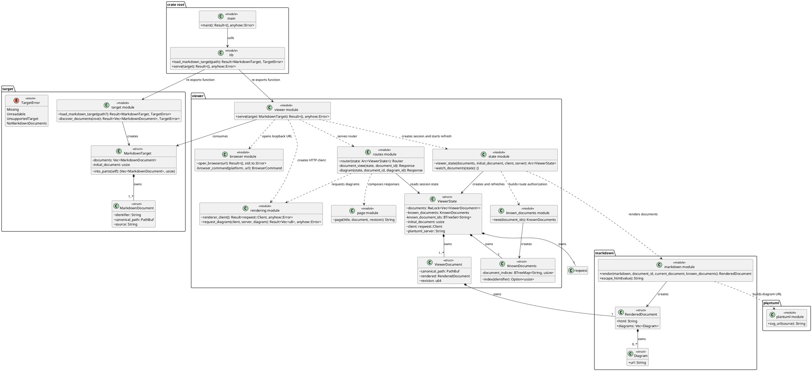

# V1 UML Design Views

Status: V1 implementation snapshot; renderer portions superseded by C7 and
navigation responsibilities refined under ADR-020

These diagrams complement the black-box [SSD-01](ssd-01-open-markdown-target.md)
and [SSD-02](ssd-02-open-document-root.md). They show the runtime collaborators
and implemented Rust modules, including owned state. They do not introduce
additional behavior or abstractions.

The current server-rendering collaboration is modeled separately in the
[server-only PlantUML rendering design](server-rendering-design.md). C7
supersedes the renderer-specific portions of this implementation snapshot,
while the document-root responsibilities here remain active.

## CMP-01: Component and Deployment View

```plantuml
@startuml
left to right direction
skinparam componentStyle rectangle

actor Developer
node "Linux workstation" {
  component "lens binary\n(main)" as CLI
  component "target module" as Target
  component "viewer module\n127.0.0.1 ephemeral port" as Viewer
  component "markdown module" as Markdown
  component "plantuml module" as Encoder
  component "System browser\nxdg-open" as Browser
  database "Document root\nMarkdown files" as Files
}
cloud "Public PlantUML server" as PlantUML

Developer --> CLI : lens [TARGET]
CLI --> Target : load target
Target --> Files : discover and read
CLI --> Viewer : serve document set
Viewer --> Browser : open loopback URL
Browser --> Viewer : GET documents and diagrams
Viewer --> Markdown : render document
Markdown --> Encoder : SVG URL for PlantUML blocks
Viewer --> PlantUML : HTTPS GET SVG
Viewer --> Browser : HTML or SVG
@enduml
```

The browser reaches only the local viewer. The viewer resolves document routes
only through its discovered document set, then retrieves PlantUML SVG through
the public renderer.

## RZ-01: Open and Navigate a Document Root

Use-case realization: `UC-02`, `UC-03`, and `UC-04`

```plantuml
@startuml
actor Developer
participant "main::main\n<<function>>" as Main
participant "target::load_markdown_target\n<<function>>" as Target
database "Filesystem" as Files
participant "viewer::serve\n<<function>>" as Serve
participant "ViewerState\n<<struct>>" as State
participant "KnownDocuments\n<<struct>>" as KnownDocuments
actor "System browser" as Browser
participant "Axum document handler\n<<function>>" as Handler
participant "markdown::render\n<<function>>" as Render
participant "reqwest::Client\n<<struct>>" as Client
participant "Public PlantUML server" as PlantUML

Developer -> Main : lens(target?)
Main -> Target : load_markdown_target(target?)
Target -> Files : canonicalize, discover, read
Files --> Target : Markdown documents
Target --> Main : Result<MarkdownTarget, TargetError>
Main -> Serve : serve(target)
Serve -> Render : render each discovered document
Render --> Serve : immutable HTML and diagram URLs
Serve -> State : viewer_state(rendered documents, initial document, client)
Serve -> Browser : xdg-open(loopback URL)

Browser -> Handler : GET / or /documents/{id}
Handler -> KnownDocuments : index(document ID)
KnownDocuments --> Handler : Option<document index>
Handler -> State : read rendered document
Handler --> Browser : rendered document

Browser -> Handler : GET /diagrams/{document ID}/{diagram ID}
Handler -> State : resolve known document ID
Handler -> State : resolve cached diagram URL
Handler -> Client : GET SVG with timeout and size limit
Client -> PlantUML : HTTPS GET encoded SVG URL
PlantUML --> Client : SVG or error
Client --> Handler : Result<SVG, error>
Handler --> Browser : SVG or 502
@enduml
```

Responsibility notes:

- `main` is the process boundary: it parses the CLI target once and delegates.
- `target` is the information expert for canonicalization and document discovery.
- `ViewerState` owns pre-rendered documents, the fixed route-authorization
  lookup, and the fixed identifier set used to rewrite authored links.
- `markdown::render` is a stateless transformation; it rewrites only known
  document links and creates document-scoped diagram URLs.
- Diagram URLs are computed once at session creation and remain immutable for
  the session lifetime.

## DCD-01: Rust Module and Type View

```plantuml
@startuml
hide empty members
skinparam classAttributeIconSize 0

package "crate root" {
  class "main" as Main <<module>> {
    +main(): Result<(), anyhow::Error>
  }
  class "lib" as Lib <<module>> {
    +load_markdown_target(path): Result<MarkdownTarget, TargetError>
    +serve(target): Result<(), anyhow::Error>
  }
}

package "target" {
  class "target module" as TargetModule <<module>> {
    +load_markdown_target(path?): Result<MarkdownTarget, TargetError>
    -discover_documents(root): Result<Vec<MarkdownDocument>, TargetError>
  }
  class MarkdownTarget <<struct>> {
    -documents: Vec<MarkdownDocument>
    -initial_document: usize
    ~into_parts(self): (Vec<MarkdownDocument>, usize)
  }
  class MarkdownDocument <<struct>> {
    ~identifier: String
    ~canonical_path: PathBuf
    ~source: String
  }
  enum TargetError <<enum>> {
    Missing
    Unreadable
    UnsupportedTarget
    NoMarkdownDocuments
  }
}

package "viewer" {
  class "viewer module" as ViewerModule <<module>> {
    +serve(target: MarkdownTarget): Result<(), anyhow::Error>
  }
  class "browser module" as BrowserModule <<module>> {
    ~open_browser(url): Result<(), std::io::Error>
    -browser_command(platform, url): BrowserCommand
  }
  class "routes module" as RoutesModule <<module>> {
    ~router(state: Arc<ViewerState>): Router
    -document_view(state, document_id): Response
    -diagram(state, document_id, diagram_id): Response
  }
  class "page module" as PageModule <<module>> {
    ~page(title, document, revision): String
  }
  class "rendering module" as RenderingModule <<module>> {
    ~renderer_client(): Result<reqwest::Client, anyhow::Error>
    ~request_diagram(client, server, diagram): Result<Vec<u8>, anyhow::Error>
  }
  class "state module" as StateModule <<module>> {
    ~viewer_state(documents, initial_document, client, server): Arc<ViewerState>
    ~watch_documents(state): ()
  }
  class "known_documents module" as KnownDocumentsModule <<module>> {
    ~new(document_ids): KnownDocuments
  }
  class KnownDocuments <<struct>> {
    -document_indices: BTreeMap<String, usize>
    ~index(identifier): Option<usize>
  }
  class ViewerState <<struct>> {
    ~documents: RwLock<Vec<ViewerDocument>>
    ~known_documents: KnownDocuments
    -known_document_ids: BTreeSet<String>
    ~initial_document: usize
    ~client: reqwest::Client
    ~plantuml_server: String
  }
  class ViewerDocument <<struct>> {
    ~canonical_path: PathBuf
    ~rendered: RenderedDocument
    ~revision: u64
  }
}

package "markdown" {
  class "markdown module" as MarkdownModule <<module>> {
    +render(markdown, document_id, current_document, known_documents): RenderedDocument
    +escape_html(value): String
  }
  class RenderedDocument <<struct>> {
    +html: String
    +diagrams: Vec<Diagram>
  }
  class Diagram <<struct>> {
    +url: String
  }
}

package "plantuml" {
  class "plantuml module" as PlantUmlModule <<module>> {
    +svg_url(source): String
  }
}

Main --> Lib : calls
Lib --> TargetModule : re-exports function
Lib --> ViewerModule : re-exports function
TargetModule --> MarkdownTarget : creates
MarkdownTarget *-- "1..*" MarkdownDocument : owns
ViewerModule --> MarkdownTarget : consumes
ViewerModule ..> BrowserModule : opens loopback URL
ViewerModule ..> RenderingModule : creates HTTP client
ViewerModule ..> RoutesModule : serves router
ViewerModule ..> StateModule : creates session and starts refresh
RoutesModule ..> PageModule : composes responses
RoutesModule ..> RenderingModule : requests diagrams
RoutesModule --> ViewerState : reads session state
StateModule --> ViewerState : creates and refreshes
StateModule ..> MarkdownModule : renders documents
StateModule ..> KnownDocumentsModule : builds route authorization
ViewerState *-- "1..*" ViewerDocument : owns
ViewerState *-- "1" KnownDocuments : owns
ViewerDocument *-- "1" RenderedDocument : owns
ViewerState *-- "1" "reqwest::Client" : owns
KnownDocumentsModule --> KnownDocuments : creates
MarkdownModule --> RenderedDocument : creates
RenderedDocument *-- "0..*" Diagram : owns
MarkdownModule ..> PlantUmlModule : builds diagram URL
@enduml
```

Rust adaptation notes:

- The diagram uses `<<module>>` for cohesive free functions and `<<struct>>` or
  `<<enum>>` only for actual Rust types.
- Composition denotes owned fields. Dependencies denote parameter-only or
  function-call collaboration.
- `MarkdownTarget::into_parts(self)` consumes the target at the transition to
  the viewer, making the ownership transfer explicit.
- `ViewerState` remains one session-owned, cross-task value behind `Arc`; its
  document collection stays behind `RwLock`. The split does not add locks or
  hold a lock across an `.await`.
- The viewer module is the composition root. Route functions coordinate Axum
  requests, while state, page, rendering, known-document authorization, and
  browser modules own their specialized behavior and tests.
- JavaScript and CSS remain compile-time-owned data included by the page module
  from dedicated asset files; they do not become runtime filesystem inputs.
- There are no new traits because the viewer uses one session-configured
  PlantUML server, and the extracted modules introduce no new runtime variation
  point.
