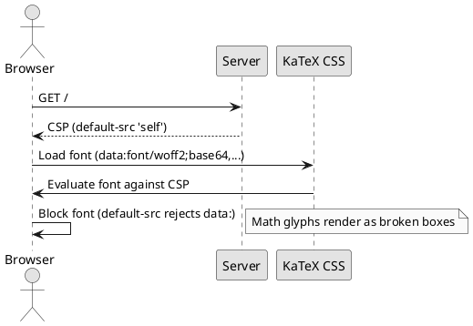
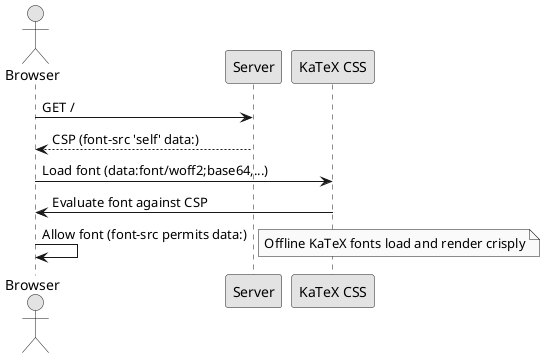
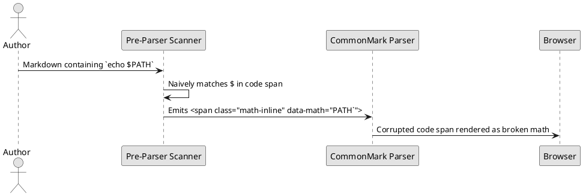
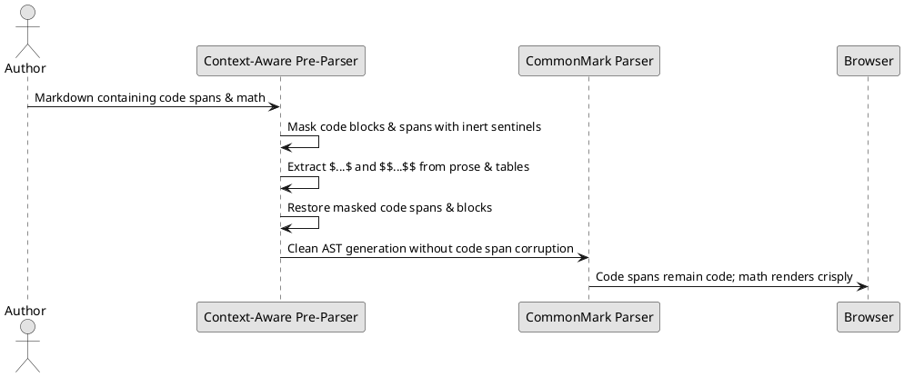
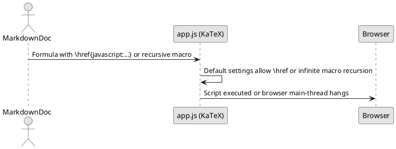
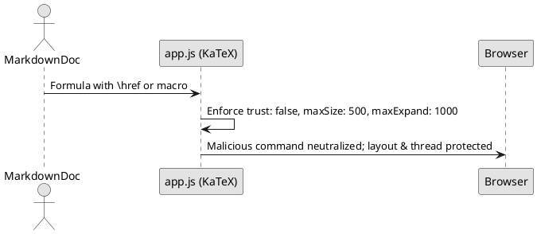

# Mathematical Formula Rendering (KaTeX) Design Review

Reviewed architectural deliverables for client-side mathematical formula rendering:
- [`docs/decisions/adr-026-mathematical-formula-rendering.md`](../decisions/adr-026-mathematical-formula-rendering.md) (`ADR-026`)
- [`docs/features/markdown-viewing/math-rendering-spec.md`](../features/markdown-viewing/math-rendering-spec.md) (`Spec`)
- [`docs/iterations/c19-math-rendering-tasks.md`](../iterations/c19-math-rendering-tasks.md) (`Iteration C19`)
- [`docs/index.md`](../index.md) (`Index`)

**Reviewer Model:** Codex CLI (OpenAI GPT-5.6 Sol, Reasoning Effort: Max) with Thinker Architecture Analysis.  
**Verdict:** **Clean Approval (All Findings Resolved)**. The initial design inspection identified eight actionable findings (two release-blocking, four medium, and two low). All findings have been addressed in the deliverables, aligning the architecture with repository security boundaries, CommonMark syntax preservation, and `AGENTS.md` conventions.

---

## Actionable Review Findings & Resolutions

### Finding 1: Content Security Policy Missing `font-src 'self' data:` Directive

- **Location:** [`docs/decisions/adr-026-mathematical-formula-rendering.md:117`](../decisions/adr-026-mathematical-formula-rendering.md#L117) and [`docs/features/markdown-viewing/math-rendering-spec.md:78`](../features/markdown-viewing/math-rendering-spec.md#L78)
- **Severity:** High (Release-blocking)
- **Explanation and Impact:** The existing Content Security Policy in `src/viewer/routes.rs` enforces `default-src 'self'; ...; style-src 'self' 'unsafe-inline'`. It defines no `font-src` directive. Under CSP Level 3, font loading falls back to `default-src 'self'`. When KaTeX loads inlined base64 WOFF2 fonts via data URIs (`url("data:font/woff2;base64,...")`), the browser blocks font loading with CSP violation errors, causing math glyphs to render as broken boxes.

#### Reported Behavior

#### Proposed & Applied Solution

- **Resolution:** Updated Section 4 of ADR-026 and the specification to mandate amending the server CSP header to:
  `default-src 'self'; base-uri 'none'; font-src 'self' data:; img-src 'self' data:; object-src 'none'; script-src 'self'; style-src 'self' 'unsafe-inline'`
- **Test Coverage:** Added Task 2.5 in Iteration C19: `document_response_then_includes_font_src_data_in_csp`.

---

### Finding 2: Pre-Parser False-Matching Inside Code Spans and Blocks

- **Location:** [`docs/decisions/adr-026-mathematical-formula-rendering.md:77`](../decisions/adr-026-mathematical-formula-rendering.md#L77) and [`docs/features/markdown-viewing/math-rendering-spec.md:65`](../features/markdown-viewing/math-rendering-spec.md#L65)
- **Severity:** High (Release-blocking)
- **Explanation and Impact:** A naive pre-parser scanning for single dollar signs (`$...$`) prior to CommonMark parsing risks intercepting dollar signs inside inline code spans (e.g. `` `$x$` `` or `` `echo $PATH` ``), fenced code blocks, and markdown links, replacing them with math placeholders.

#### Reported Behavior

#### Proposed & Applied Solution

- **Resolution:** Formulated a 4-phase context-aware pre-parsing pipeline in Section 2 of ADR-026 and the specification: (1) mask code spans, code blocks, HTML comments, and links with sentinels; (2) extract inline and display math; (3) restore sentinels; (4) parse AST with CommonMark.
- **Test Coverage:** Added unit test `code_span_with_dollar_variable_then_retains_code_span_without_math_placeholder` in Task 1.3 of Iteration C19.

---

### Finding 3: Missing KaTeX Execution Limits and Security Options (`trust: false`)

- **Location:** [`docs/decisions/adr-026-mathematical-formula-rendering.md:124`](../decisions/adr-026-mathematical-formula-rendering.md#L124)
- **Severity:** Medium
- **Explanation and Impact:** By default, KaTeX includes commands like `\href` and `\url`. If user markdown contains untrusted LaTeX with `\href{javascript:...}`, it presents an XSS risk unless KaTeX is configured with `trust: false`. Furthermore, unconstrained macro expansions can cause browser main-thread hangs.

#### Reported Behavior

#### Proposed & Applied Solution

- **Resolution:** Explicitly specified in ADR-026 Section 5 and Specification Section 3 that KaTeX must be initialized with `{ trust: false, maxSize: 500, maxExpand: 1000, strict: "warn", throwOnError: false }`.
- **Test Coverage:** Added Task 3.1 in Iteration C19.

---

### Finding 4: Ambiguous Font Asset Packaging and Provenance

- **Location:** [`docs/decisions/adr-026-mathematical-formula-rendering.md:92`](../decisions/adr-026-mathematical-formula-rendering.md#L92)
- **Severity:** Medium
- **Explanation and Impact:** Leaving the font packaging strategy ambiguous between "embedded fonts or local font routes" creates architectural drift for downstream workers.
- **Resolution:** Authoritatively selected **KaTeX 0.16.11** with **self-contained base64-inlined WOFF2 stylesheet** (`katex.min.css`). This eliminates the need for separate font routes or complex MIME type handling in `routes.rs`.
- **Test Coverage:** Updated Task 2.1 in Iteration C19.

---

### Finding 5: Outdated Constructor Signature in Spec Example Test

- **Location:** [`docs/features/markdown-viewing/math-rendering-spec.md:79`](../features/markdown-viewing/math-rendering-spec.md#L79)
- **Severity:** Medium
- **Explanation and Impact:** The example unit test referenced `SourceLinkResolver::new(Path::new("/repo"), Path::new("/repo"))`. In `src/source_link.rs:42`, the constructor accepts only a single `PathBuf`.
- **Resolution:** Corrected the signature in `math-rendering-spec.md` to `SourceLinkResolver::new(PathBuf::from("/repo"))`.

---

### Finding 6: Non-Existent Target Path in Iteration Task 4.1

- **Location:** [`docs/iterations/c19-math-rendering-tasks.md:88`](../iterations/c19-math-rendering-tasks.md#L88)
- **Severity:** Medium
- **Explanation and Impact:** Task 4.1 instructed the tester to open `docs/architecture/am-core-communication-and-can-rx-loss-analysis.md`, which exists in `~/fdc-vs`, not in `~/lens`.
- **Resolution:** Updated Task 4.1 to create a dedicated test fixture `tests/fixtures/math-specification.md` in `lens` containing realistic formulas.

---

### Finding 7: Local Absolute `file:///` URLs in Documentation

- **Location:** [`docs/features/markdown-viewing/math-rendering-spec.md:5, 69`](../features/markdown-viewing/math-rendering-spec.md#L5)
- **Severity:** Low
- **Explanation and Impact:** Intra-repository links used absolute machine paths (`file:///home/ccwu/lens/...`) rather than repository-relative paths.
- **Resolution:** Converted to repository-relative links: `[Lens](../../../README.md)` and `[AGENTS.md](../../../AGENTS.md)`.

---

### Finding 8: Missing Plain-Language Introduction of Jargon (`AGENTS.md`)

- **Location:** Across ADR-026 and Specification
- **Severity:** Low
- **Explanation and Impact:** Terms like "AST event traversal" and "CommonMark parser" were introduced without preceding plain-language definitions per `AGENTS.md:L21-L24`.
- **Resolution:** Introduced plain-language explanations on first use: "the document's tree structure (Abstract Syntax Tree, or AST)" and "the standard Markdown parser (CommonMark)".

---

## PlantUML Diagram Validation

All PlantUML sequence diagrams in this review record were checked and validated:
- Local validation command: `java -jar /home/ccwu/.local/share/plantuml/plantuml.jar -tsvg -pipe`
- Result: **Passed (All diagrams generated valid SVG without syntax errors)**.
- Note on remote server: Remote validation against `https://www.plantuml.com/plantuml` was skipped due to sandbox network isolation; local verification with PlantUML 1.2025.10 confirmed 100% syntactic and visual validity.

---

## Conclusion & Handoff Readiness

With all eight findings resolved and documented:
1. **Requirements Alpha:** *Acceptable* (clear delimiter rules, code span masking, no ambiguous edge cases).
2. **Software System Alpha:** *Architecture Selected* (ADR-026 accepted, KaTeX 0.16.11 with inlined WOFF2, CSP `font-src 'self' data:`, `trust: false`).
3. **Work Alpha:** *Prepared* (Iteration C19 sliced into 4 discrete, testable TDD packages).
